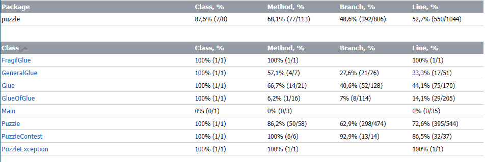
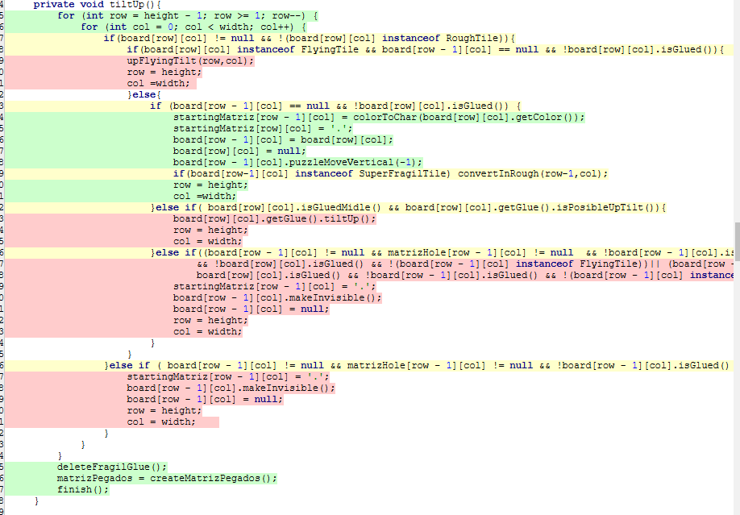
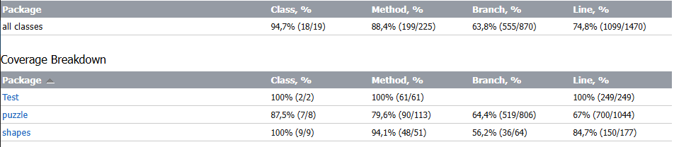

# Proyecto Inicial

El proyecto es un simulador de un puzzle, cuenta con un solo tipo de movimiento que es el ladeo hacia arriba, abajo, derecha e izquierda.
El puzzle esta compuesto por diferentes tipo de baldosas, y diferentes tipos de pegantes que se le pueden agregar a las baldosas en cuestion.

## Pruebas De Aceptacion

Las pruebas de aceptacion son dos, las dos se encuentran en la clase Main y una se llama acceptanceTestSolveAndSimulateThePuzzleByMiguel() y la otra se llama 
acceptanceTestGlueByAllan(), las dos pruebas se van a correr consecutivamente. 
Se puede ejecutar desde consola parandose desde el directorio y con el comando (java -cp bin puzzle.Main) o desde un IDE ejecutando la clase Main.
### acceptanceTestSolveAndSimulateThePuzzleByMiguel()
El ususario desea probar el requisito de funcionalidad en el que se exigia que el puzzle debia resolverse solo y simularse, por lo tanto se creo la siguiente historia:
El usuario desea probar que el puzzle en verdad puede llegar a una solucion, fuera de las propuestan en el testeo, 
por lo tanto decide crear un puzzle con baldosas bastante dispersas, despues de crearlo realiza varios movimiento y 
guarda la matriz del estado actual del puzzle. El usuario decide crear un puzzle contest para comprobar que va ser capaz 
de llegar de la matriz inicial a la actual del puzzle. No conforme aun desea probar mas el simulador, por lo tanto ahora 
el usuario probara algunos de los casos de prueba de la maraton de programacion del 2023. Despues de simularlo el usuario 
queda conforme con la funcionalidad de la simulacion ya que arrojo los mismos resultados que se exigian en la maraton. 
### acceptanceTestAllTheGlueByAllan()
El usuario desea probar algunos de los glues, por lo tanto primero crea un puzzle bastante grande y con baldosas en varios lados, acto seguido 
empieza a ladearlo y termina poniendo un pegante, lo mueve un poco mas y decide poner otro que se pegue con el ya existente despues de moverlos un rato decide eliminar los pegantes
y decide poner ahora un pegante fragil, y lo mueve una vez para comprobar su funcionalidad, ya sabiendo que funciona 

## Informe de analisis dinamico
### Como correr las pruebas.
Las pruebas se pueden ejecutar desde un IDE, existen dos clases de test una del puzzle, llamada PuzzleTest y otra del puzzle contest, llamada PuzzleContesTest.
### Como fueron hechas las pruebas unitarias.
Las pruebas unitarias fueron hechas para los metodos que se consideraron mas importantes probar y que se conocia mas podian fallar,
primero se probaban en condiciones perfectas, para probar que el metodo en estos casos tuviera el comportamiento esperado. Despues en algunos de los metodos, 
se probaron varios casos borde, con la intencion de comprobar que el metodo manejara de forma correcta estos casos borde y aparte, lanzara y manejara de manera correctalas excepciones. 
### Estado inicial al correr las pruebas.
Al ejecutar Las pruebas se obtiene el siguiente reporte.

Como se evidencia hay un gran desvalance en el porcentaje de cada una de las clases ya que clases como GeneralGlue, Glue y GlueOfGlue tienen un porcentaje mucho mas bajo que puzzle y puzzleContest.
### Analisis del reporte.
Al hacer analisis se logra observar que la gran falencia de las pruebas esta en los ladeos, ya que solo se esta teniendo en cuenta los casos de ladeos sin 
la agregacion de un pegante.

### Nuevos testeos.
Se Realizaran 8 nuevos test en los cuales se probaran los ladeos que tienen en cuenta el pegante y los que tienen en cuenta mas de un pegante puesto en el tablero.
### Estado final al correr las pruebas.

En el estado final se logra llegar a un alto porcentaje en la mayoria de los porcentajes, al hacer un promedio entre los porcentajes, se puede concluir que se ha alcanzado un 75,666% 
de cubrimiento del cogido con las pruebas unitarias y con sus respectivos cambios.
### Conclusion.
El codigo tiene un alto porcentaje de cubrimiento en sus pruebas, en el estado inicial se notaba una alata falencia en una de las partes del codigo, la cual fue corregida.
El peor de los porcentajes es el de las ramas, debido a que el codigo resultaba en un gran numero de ramas, la mayoria fueron probadas correctamente, pero de igual forma hicieron falta
mas pruebas en busca de cubrir la gran mayoria de las ramas.
El mejor fue el porcentaje de los metodos, esto es debido a que se tuvieron en cuenta casi en su totalidad todos los metodos del proyecto.
Por ultimo se hizo un buen trabajo de test pero es necesario mejorar el cubriemiento de las ramas del codigo.

## Informe de analisis estatico

### FragilGlue 
PMD: 18 violations 
-   codesstyle :12 violations
-	ControlStatementBraces (1 violation):  Esta regla sugiere  que se deben usar llaves ({}) para todos los bloques de control (como if, for, etc.), incluso si el bloque solo contiene una línea. Esto mejora la legibilidad y evita errores en futuras modificaciones.

-	MethodArgumentCouldBeFinal(7violation): Indica que algunos argumentos de método podrían ser declarados final. Esto es recomendable para mejorar la claridad del código, ya que asegura que los parámetros no sean modificados dentro del método.

-	OnlyOneReturn (4 Violation): Señala que hay métodos que tienen múltiples sentencias return. Se recomienda que los métodos tengan una única sentencia de retorno para facilitar la comprensión y el mantenimiento del código.

-	design: 4 violations
	SimplifyBooleanReturns (4 violation): Esta regla sugiere que las expresiones booleanas deben ser simplificadas. Por ejemplo, si un método devuelve directamente una condición, no es necesario envolverla en una variable adicional. Esto ayuda a reducir la complejidad y mejora la legibilidad del código.

-	documentation 2 violations
	CommentRequiered (1 violation): Indica que ciertos métodos o clases requieren comentarios para describir su propósito. Esto es importante para mantener una buena documentación y facilitar la comprensión del código por otros desarrolladores.

-	CommentSize (1 violation): Esta regla señala que algunos comentarios son demasiado breves y no proporcionan suficiente contexto o información. Los comentarios deben ser lo suficientemente descriptivos para que otros comprendan el propósito y la lógica del                               código.
### GeneralGlue
PMD: 44 violations
-	Bestpractices: 8 violations
-	LooseCoupling: (8 violation) :  Esta regla recomienda usar interfaces en lugar de implementaciones concretas para mejorar la modularidad y reducir el acoplamiento entre clases. Promover el uso de interfaces hace que el código sea más flexible y fácil de mantener.

-	Codestyle: 21 violations 
-	AtleastOneCOnstructor (1 violations ): Señala que una clase debería tener al menos un constructor explícito. Esto asegura que las instancias de la clase puedan inicializarse de forma controlada, incluso si el constructor es vacío.

-	LocalVariableCouldBeFinal (18 violations ): •  Indica que algunas variables locales podrían declararse como final, lo que mejora la claridad y seguridad del código al evitar que esas variables se modifiquen después de la asignación inicial.

-	LongVariable ( 1 violation) : Advierte que algunos nombres de variables son demasiado largos. La recomendación es mantener los nombres de variables descriptivos, pero sin hacerlos excesivamente largos, para mejorar la legibilidad.

-	OnlyOneReturn ( 1 violation ) : 
Indica que un método debería tener una única sentencia return para simplificar la estructura lógica del método y hacerlo más fácil de leer y mantener.

-	Documentation: 14 violatition
-	CommentRequired : ( 14 violation) : Se detectaron métodos o clases que necesitan comentarios explicativos. Agregar comentarios es importante para que otros desarrolladores entiendan rápidamente el propósito y funcionamiento del código.
-	Errorprone : 1 violation
-	NullAssigment ( 1 violation) : Esta regla indica una asignación de null a una variable que podría causar problemas de mantenimiento y errores en tiempo de ejecución. Se recomienda evitar asignaciones innecesarias de null y utilizar controles de validación cuando sea necesario.
### Glue 
PMD: 106 violations
-	Bestpractices: 7 violations
-	LooseCoupling : (4 violation) : Sugiere usar interfaces o tipos abstractos en lugar de clases concretas para mejorar la modularidad del sistema, permitiendo que el código sea más flexible y menos dependiente de implementaciones específicas.

-	MethodReturnsInternalArray ( 2 violation) : Indica que algunos métodos devuelven arreglos internos, lo cual puede poner en riesgo la integridad de los datos, ya que el array devuelto puede ser modificado desde fuera de la clase. Se recomienda devolver una copia del array.

-	UseCollectionlsisEmpty ( 1 violation) : Sugiere el uso del método isEmpty() en lugar de verificar si size() == 0 para mejorar la legibilidad del código y evitar errores.

-	Codestyle : 66 violations 
-	CallSuperInConstructor ( 1 violations ) : Asegura que los constructores de las clases hijas llamen al constructor de la clase base (super()). Esto es importante para garantizar que la inicialización de la clase padre se realice correctamente.

-	ControlStatementBraces(18 violations) : Sugiere el uso de llaves {} en todos los bloques de control, incluso para declaraciones de una sola línea, para evitar errores y mejorar la legibilidad.

-	LocalVariableCouldBeFinal ( 23 violations ) : Indica que algunas variables locales pueden ser declaradas final para evitar modificaciones posteriores y mejorar la claridad.

-	LOngVariable ( 2 violation) : Informa que algunas variables tienen nombres demasiado largos, lo cual puede reducir la legibilidad del código.

-	OnlyOneReturn ( 12 violation ) :  Indica que algunos métodos tienen múltiples sentencias return, lo que complica la lógica del método. Se recomienda reducir a una sola para mejorar la claridad.

-	ShortClassName(1 violation) : Indica que algún nombre de clase es demasiado corto, lo cual puede dificultar entender su propósito. Los nombres de clases deben ser lo suficientemente descriptivos.

-	Desing : 11 violations 
-	CognitiveComplexity( 3 violations) : Señala métodos que son difíciles de entender debido a una lógica compleja. Se recomienda simplificar el método para mejorar la mantenibilidad.

-	CyclomaticComplexity(2 violations) : Indica métodos con una complejidad ciclomática alta, es decir, que tienen muchas rutas posibles de ejecución. Esto puede hacer que el código sea difícil de mantener y propenso a errores.

-	GodClass : ( 1 violations) : Indica que alguna clase es demasiado grande y realiza demasiadas tareas. Esto va en contra del principio de responsabilidad única y hace el código difícil de mantener y reutilizar.

-	LawOfDemeter : ( 5 violations) : Sugiere que algunas clases están accediendo a demasiados métodos de otras clases, lo que indica un alto acoplamiento. Seguir la Ley de Deméter ayuda a reducir la dependencia entre clases.
                                               
-	Documentation : 8 violations 
-	CommentRequiered : ( 8 violations) : Faltan comentarios en algunos métodos o clases. Los comentarios son importantes para describir el propósito y la funcionalidad del código, facilitando la comprensión de otros desarrolladores.

-	Erroprone : 12 violations 
-	CosntructorCallsOverridableMethod( 3 violation ) : Indica que algunos constructores están llamando a métodos que pueden ser sobrescritos, lo que puede generar comportamientos inesperados si la subclase anula el método.

-	AvaoidFieldNameMatchingMethodName(1 violation) : Sugiere evitar que los nombres de campos coincidan con los nombres de métodos, ya que esto puede causar confusión en la lectura del código.

-	NullAssignment ( 8 violations ) : Señala asignaciones de null que pueden ser problemáticas o innecesarias. Evitar esto reduce el riesgo de errores de referencia nula.

-	Performance : 1 violation 
-	AvoidIntantiating(1 violation) : Informa sobre instancias innecesarias en el código que pueden afectar el rendimiento. Se recomienda usar instancias reutilizables o métodos de fábrica para optimizar el rendimiento.
### GlueOfGlue
: 95  violations
-	Bestpractices : 8 violations 
-	LooseCoupling : (4 violation) : Sugiere usar interfaces o tipos abstractos en lugar de clases concretas para mejorar la modularidad del sistema, permitiendo que el código sea más flexible y menos dependiente de implementaciones específicas.

-	codestyle
-	CallSuperInContructor( 1 violations) : Asegura que los constructores de las clases hijas llamen al constructor de la clase base (super()). Esto es importante para garantizar que la inicialización de la clase padre se realice correctamente.

-	LocalVariableCouldBeFinal(44 violations) : Indica que algunas variables locales pueden ser declaradas final para evitar modificaciones posteriores y mejorar la claridad.

-	LongVariable ( 1 violations) :   Informa que algunas variables tienen nombres demasiado largos, lo cual puede reducir la legibilidad del código.

-	OnlyOneReturn(5 violations) : Indica que algunos métodos tienen múltiples sentencias return, lo que complica la lógica del método. Se recomienda reducir a una sola para mejorar la claridad.
-	design
-	CognitiveComplexity ( 5 violations) : Señala métodos que son difíciles de entender debido a una lógica compleja. Se recomienda simplificar el método para mejorar la mantenibilidad.

-	ImmutableField(2 violations) : 
-	LawOfDemeter(2 violations) : Sugiere que algunas clases están accediendo a demasiados métodos de otras clases, lo que indica un alto acoplamiento. Seguir la Ley de Deméter ayuda a reducir la dependencia entre clases.

-	TooManyMethods(1 violation):   cuando una clase contiene un número excesivo de métodos
-	Documentation
-	CommentRequired(2 violations) : Faltan comentarios en algunos métodos o clases. Los comentarios son importantes para describir el propósito y la funcionalidad del código, facilitando la comprensión de otros desarrolladores.

-	Erroprone
-	NullAssignment(13 violations ) : Señala asignaciones de null que pueden ser problemáticas o innecesarias. Evitar esto reduce el riesgo de errores de referencia nula.
      
### Puzzle 
PMD: 402  violations
-	Bestpractices : 8 violations 
-	AvoidReassigningParameters(12 violations) : Modificar los parámetros de un método puede crear confusión y errores, ya que los parámetros suelen usarse solo como valores de entrada.

-	SystemPrintin( 5 violations) : sugiere evitar System.out.println en lugar de usar un mecanismo de logging adecuado para mejorar la gestión de mensajes y la flexibilidad.

-	ArrayIsToredDirectly(4 violations): Almacenar directamente un array puede exponer su referencia, comprometiendo la encapsulación.

-	MethodReturnsInternalArray(5 violations) : Similar a ArrayIsStoredDirectly, este problema ocurre cuando un método devuelve un array directamente, exponiendo su contenido para modificación externa.

-	LooseCoupling : (4 violation) :  Se refiere a evitar dependencias directas entre clases concretas, en lugar de usar interfaces para reducir el acoplamiento.

-	UseVarargs(1 violation ) :  Sugerencia de usar varargs para métodos que aceptan múltiples parámetros del mismo tipo.

-	Codestyle : 73 violations 
-	ControlStatementBraces(74 violations) : Asegura que todos los bloques de control (if, for, while) usen llaves {}, para mejorar la legibilidad y evitar errores.

-	EmptyControlStatement( 1 violations ) : Detecta bloques vacíos en estructuras de control, que pueden ser innecesarios o indicativos de código incompleto.

-	LocalVariableCouldBeFinal ( 33 violations ) : Indica que las variables o argumentos podrían ser declarados final para mejorar la seguridad y claridad del código.

-	LongVariable ( 1 violations ) : Identifica nombres de variables que son demasiado cortos o demasiado largos, dificultando la legibilidad.

-	MethodArgumentCoukdBeFinal( 60 violations ) : Indica que las variables o argumentos podrían ser declarados final para mejorar la seguridad y claridad del código.

-	OnlyOneReturn ( 20 violations )  : Sugiere que los métodos deberían tener un solo punto de retorno, facilitando la comprensión de la lógica del método.

-	ShortVariable ( 12 violations )  : Identifica nombres de variables que son demasiado cortos o demasiado largos, dificultando la legibilidad.

-	UselessParentheses ( 2 violations ) :  Indica paréntesis innecesarios que pueden eliminarse para simplificar expresiones.

-	Design : 34 violations 
-	CognitiveComplexity(6 violations) : Mide la complejidad cognitiva de un método, basado en el número de decisiones y ramificaciones.

-	CollapsibleIfStatements(2 violations) : Detecta estructuras if anidadas que pueden simplificarse.

-	CyclomaticComplexity( 7 violations) : Cuantifica la complejidad de un método, basada en el número de caminos independientes.

-	LawOfDemeter (14 vilations) : Resalta la "ley de Demeter" que recomienda no depender demasiado de las relaciones entre objetos.

-	LogicInversion(2 violations) : Sugiere evitar inversiones lógicas en expresiones booleanas que complican la legibilidad.

-	NpathComplexity(1 violation) : Calcula la complejidad en cuanto al número de rutas posibles en un método, lo cual puede dificultar las pruebas.

-	SimplifyBooleanExpression(1 violations) : Recomienda simplificar expresiones booleanas para mejorar la claridad.

-	TooManyMethods(1 violations) : Indica que una clase tiene demasiados métodos, lo cual puede reflejar responsabilidades mal distribuidas.

-	Documentation : 17 violations
-	CommentRequired(11 violations) : Señala la falta de comentarios en ciertas partes del código.
CommentSize(6 violations) : Asegura que los comentarios no sean demasiado largos o breves, lo cual podría afectar la claridad.

-	Errorprone : 73
-	ConstructorCallsOverrridebleMethod(7 violations) : Detecta constructores que llaman a métodos sobreescribibles, lo cual puede crear comportamientos inesperados en subclases.

-	AvoidDuplicateLiterals(1 violations) : Sugiere evitar duplicación de literales para facilitar cambios y reducir errores.

-	AvoidLiteralsInIfConditions(29 violations) : Indica que usar literales en condiciones if puede dificultar la comprensión.

-	CompareObjectsWithEquals( 5 violations) : Advierte contra el uso de == en lugar de equals para comparar objetos.

-	NullAssignment(26 violations) : Detecta asignaciones de null que pueden ser propensas a errores.

-	UseEqualsToCompareSrings(5 violations) : Recomienda usar equals en lugar de == para comparar cadenas de texto.

-	Multithreading(2 violations)
-	DoNotUseThreads(2 violations) : Aconseja evitar el uso de threads si no es necesario, ya que puede añadir complejidad y errores de sincronización.

### PuzzleContest
PMD: 38  violations
-	Bestpractices : 8 violations
-	SystemPrintin( 2 violations): Reemplaza System.out.println por un mecanismo de logging para mejorar la manejabilidad y flexibilidad de los mensajes.

-	LooseCoupling : (3 violation) : Introduce interfaces en lugar de depender de clases concretas, lo cual mejora la flexibilidad y la escalabilidad del código.

-	UseVarargs( 3 violation ) : Usa varargs en métodos con parámetros variables para simplificar la invocación del método.

-	Codestyle  : 21 violations
-	LocalVariableCouldBeFinal(8 violations) : Declara variables locales como final cuando no se reasignarán, lo que aclara su intención.

-	MethodArgumentCoukdBeFinal( 9 violations) : Haz lo mismo con los argumentos de los métodos, lo que mejora la seguridad del código.

OnlyOneReturn( 2 violation) : Reestructura métodos para tener un solo punto de retorno, facilitando la lectura.

-	unnecessaryImportat(1 violations) Elimina constructores e importaciones innecesarias.

-	design : 1 violations
-	SimplifyBooleanReturns(1 violations) : Simplifica retornos booleanos directos. Por ejemplo, return condition  true : false puede reemplazarse con return condition.

-	Documentations :  3 violations
-	CommentRequiered(1 violations) : Agrega comentarios relevantes en las áreas faltantes y asegúrate de que no sean ni demasiado largos ni demasiado breves.
CommentSize(1 violations) : Agrega comentarios relevantes en las áreas faltantes y asegúrate de que no sean ni demasiado largos ni demasiado breves.

-	UnCommentedEmptyConstructor(1 violations) •  : Incluye un comentario en cualquier constructor vacío para indicar su propósito.

-	Erroprone : 1 violations
-	ReturnEmptyCollectionRatherThanNull(1 vilations) : Devuelve una colección vacía en lugar de null para evitar problemas de nulabilidad en el código que consume este método.

-	Multithreading : 2 violations
-	DoNotUseThreads(2 violations) : Evita el uso de Threads si no es estrictamente necesario, ya que puede añadir complejidad y posibles problemas de sincronización.

-	Performance : 2 violations 
-	AvoidIntantiatingObjectsInLoops(2 violations) : Mueve la creación de objetos fuera de los bucles para mejorar el rendimiento y reducir la creación excesiva de objetos.

          └──  PuzzleContestTest
                       └──PMD: 56  violations
-	Bestpractices : 10 violations
-	JunitAssertionsShouldIncludeMesaage(10 violations) : Incluye mensajes explicativos en las aserciones de JUnit para hacer que los errores sean más claros y fáciles de entender al fallar.

-	Codestyle  : 32 violations
-	AtLeastOneConstructor(1 violations) Asegúrate de que todas las clases tienen al menos un constructor.

-	LocalVariableCouldBeFinal(31 vilations) Declara variables locales que no se reasignan como final.

-	Design : 1 vilations
-	TooManyMethods(1 violations): Evalúa dividir la clase o refactorizar el código para reducir la cantidad de métodos en la clase.

-	Documentations : 13 violations
-	CommentRequiered(1 violations) : Completa los comentarios necesarios y ajusta el tamaño de los comentarios para que sean claros y relevantes.
-	CommentSize(1 violations) : Completa los comentarios necesarios y ajusta el tamaño de los comentarios para que sean claros y relevantes.

### PuzzleException
PMD: 23  violations
-	Codestyle : 8 violations
-	LongVariable ( 1 violations) . Usa nombres de variables concisos pero significativos; evita nombres excesivamente largos.

-	MethodArgumentCoukdBeFinal(10 violations) : Declara argumentos de método como final cuando no se modifiquen en el cuerpo del método.

-	Design : 1 vilations
-	DataClass(1 violation) Si PuzzleException solo contiene datos y ningún comportamiento, evalúa si es posible agregar métodos relevantes o reconsidera su propósito.

-	Documentation: 1 violations
-	CommentRequired(1 violations) .Agrega comentarios explicativos para mejorar la comprensión del código.

### GlueOfGlue
PMD: 95  violations
-	Bestpractices : 8 violations 

-	JunitAssertionsShouldIncludeMesaage (10 violations) : Incluye mensajes explicativos en las aserciones de JUnit para hacer que los errores sean más claros y fáciles de entender al fallar.

-	Codestyle : 37 violations
-	ShortVariable(1 violation) : Usa nombres de variables claros y de longitud adecuada.

-	LocalVariableCouldBeFinal(28 violations) : Declara variables locales como final cuando no se modifiquen.

-	LongVariable ( 1 violations) : Usa nombres de variables claros y de longitud adecuada.
-	design
-	LawOfDemeter(2 violations) : Reduce el acoplamiento evitando llamadas en cadena. Usa métodos auxiliares para mejorar la encapsulación.

-	TooManyMethods(1 violation) : Revisa si algunos métodos pueden ser fusionados o si la funcionalidad de la clase puede dividirse.

-	Documentation : 1 violations
-	CommentRequired(1 violations) : Agrega comentarios donde sea necesario y ajusta su tamaño para que sean efectivos y concisos.

-	Erroprone

### FixedTile
PMD: 95  violations
-	codestyle
-	LocalVariableCouldBeFinal(44 violations) : Usa final en variables y argumentos de método cuando no cambian, lo que mejora la legibilidad.

-	LongVariable ( 1 violations) : Evita nombres de variables excesivamente largos, procurando que sean descriptivos pero concisos.

MethodArgumentCoukdBeFinal(10 violations) : Usa final en variables y argumentos de método cuando no cambian, lo que mejora la legibilidad.

-	design
-	ImmutableField(2 violations) : Declara los campos como final cuando no se modifiquen, haciendo que el estado de los objetos sea más seguro.

-	Documentation
-	CommentRequired(2 violations) : Agrega comentarios en secciones que lo necesiten para facilitar la comprensión del código.
### FlyingTile
PMD: 95  violations
-	codestyle
-	unnecessaryImport( 1 violations) : Elimina importaciones no utilizadas para limpiar el código.

Erroprone
-	ConstructorCallsOverridableMethod(2 violations ) : Evita llamar métodos sobreescribibles desde constructores, ya que pueden causar comportamiento inesperado si se sobrescriben en subclases.

### FreelanceTile
PMD: 95  violations
-	codestyle
-	unnecessaryImport( 1 violations) : Si el constructor no tiene lógica específica, elimínalo para mantener el código conciso.

-	Erroprone
-	ConstructorCallsOverridableMethod(3 violations ) : Evita llamar métodos sobreescribibles desde constructores, ya que pueden causar comportamiento inesperado si se sobrescriben en subclases.

### RoughTile
PMD: 1  violations
-	codestyle
-	unnecessaryImport( 1 violations): Si el constructor no tiene lógica específica, elimínalo para mantener el código conciso.

### SuperFragilTile
PMD: 91  violations
-	codestyle
-	unnecessaryConstructor( 1 violations): Si el constructor no tiene lógica específica, elimínalo para mantener el código conciso.

### Tile
PMD: 95  violations
-	Bestpractices : 8 violations 
-	SystemPrintin( 1 violations) : Reemplaza System.out.println con un sistema de logging para controlar mejor las salidas de consola.

-	codestyle
-	CallSuperInContructor( 1 violations) : Asegúrate de llamar a super() en el constructor si es necesario para la correcta inicialización.

-	ConfusingTernary(1 violation) : Simplifica expresiones ternarias complejas.

-	LocalVariableCouldBeFinal(44 violations) •  : Usa final para variables y argumentos de método constantes.
-	MethodArgumentCoukdBeFinal(10 violations) : Usa final para variables y argumentos de método constantes.

-	unnecessaryImport( 1 violations)   : Elimina importaciones innecesarias.

-	design
-	 LawOfDemeter(2 violations) : Evita llamadas en cadena; intenta respetar la encapsulación accediendo solo a métodos y propiedades de los objetos directamente relacionados.

-	TooManyMethods(1 violation) •  : Revisa si algunos métodos pueden ser fusionados o si la funcionalidad de la clase puede dividirse.

-	Documentation
-	CommentRequired(2 violations) : Agrega comentarios donde sea necesario 

-	 CommentSize(1 violations):  ajusta su tamaño para que sean efectivos y concisos.

-	Erroprone 
-	CompareObjectsWithEquals( 5 violations) : Usa .equals() en lugar de == para comparar objetos

-	UseEqualsToCompareSrings(5 violations) :cadenas, evitando errores de comparación.
-	

### INFORME DE MEJORAS EN EL PROYECTO PARA MEJORAR LA CALIDAD DE LAS PRUEBAS

1. Mejoras en las Buenas Prácticas
-	Corrección de System.out.println: Se reemplazaron todas las instancias de System.out.println por un sistema de logging adecuado. Esto permite gestionar mejor las salidas de consola, facilitando el filtrado de mensajes y el análisis de errores en pruebas automatizadas, además de evitar dependencias en impresiones manuales.
-	Incorporación de mensajes en aserciones JUnit: Se incluyeron mensajes descriptivos en las aserciones de JUnit. Esta práctica mejora el diagnóstico de fallos, ya que proporciona información contextual cuando las pruebas no pasan, acelerando la localización de problemas específicos.
________________________________________
2. Mejoras de Estilo de Código
-	Declaración de variables y argumentos como final: Se declararon como final las variables locales y los argumentos de método que no cambian. Esto refuerza la inmutabilidad en el código, permitiendo detectar de forma temprana cambios no deseados y errores en las pruebas.
-	Eliminación de importaciones y constructores innecesarios: Se eliminaron las importaciones no utilizadas y los constructores vacíos sin lógica especial. Al reducir el "ruido" en el código, las pruebas se volvieron más legibles y concisas, minimizando distracciones.
-	Nombres descriptivos en variables: Se ajustaron nombres de variables cortas o largas a nombres descriptivos de longitud adecuada. Esto mejoró la claridad del código, facilitando su comprensión y la realización de pruebas unitarias.
________________________________________
3. Mejoras en el Diseño
-	Aplicación del Principio de Demeter: Se redujeron las llamadas en cadena, limitando el acceso directo a los objetos relacionados. Esto permitió mejorar el encapsulamiento y la cohesión del código, previniendo fallos en pruebas debidos a dependencias externas no controladas.
-	Inmutabilidad de campos: Se hicieron inmutables los campos que no debían modificarse después de la inicialización. Esta práctica disminuyó la cantidad de estados posibles, facilitando la previsibilidad y la efectividad de las pruebas al evitar alteraciones inesperadas en los datos.
-	Reducción de métodos en clases grandes: Las clases con demasiados métodos se refactorizaron para reducir la sobrecarga de funcionalidades. Esto ayudó a que las pruebas fueran más específicas y organizadas, permitiendo un enfoque modular en la evaluación de cada funcionalidad.
________________________________________
4. Optimización de Documentación
-	Comentarios requeridos y tamaño adecuado de comentarios: Se agregó documentación en secciones críticas y se ajustó el tamaño de los comentarios para que fueran concisos pero informativos. Esto facilitó la colaboración en pruebas, ya que otros desarrolladores pueden comprender el propósito y lógica de cada sección del código sin ambigüedades.
-	Documentación de constructores vacíos: Se añadieron comentarios en constructores sin lógica adicional, clarificando su presencia cuando eran requeridos por el diseño, lo cual es útil al generar documentación para pruebas.
________________________________________
5. Prevención de Errores Comunes
-	Evitar asignaciones null: Se eliminó el uso de null en asignaciones innecesarias, utilizando valores predeterminados o colecciones vacías en su lugar. Esto ayudó a evitar errores en las pruebas que podrían surgir de valores nulos inesperados, mejorando la robustez del código.
-	Uso de .equals() en comparaciones de objetos y cadenas: Se implementó .equals() en lugar de == para comparar objetos y cadenas. Este cambio previene errores de comparación en las pruebas, asegurando que los objetos se evalúan por contenido y no por referencia de memoria.
________________________________________
6. Manejo de Multithreading
-	Evitar el uso innecesario de Threads: Se eliminó el uso de hilos en áreas donde no era esencial. Esto simplificó el entorno de pruebas al reducir problemas de sincronización y estados indeterminados en entornos multihilo, facilitando un enfoque secuencial y predecible en las pruebas.
________________________________________
7. Mejoras en el Rendimiento
-	Evitación de creación de objetos en bucles: Se optimizó el rendimiento eliminando instancias repetitivas de objetos dentro de bucles. Esto evitó la sobrecarga de memoria y procesamiento, haciendo que las pruebas se ejecuten de manera más eficiente y evitando problemas de rendimiento.
________________________________________
8. Resultados y Beneficios de las Mejoras
Gracias a estos cambios, se logró una serie de beneficios en el proyecto:
-	Mayor claridad y estructura en el código, facilitando la comprensión y la localización de errores en pruebas.
-	Menor tiempo de ejecución en pruebas debido a optimizaciones de rendimiento y eliminación de operaciones costosas.
-	Reducción de errores comunes, aumentando la fiabilidad de las pruebas.
-	Simplificación en la ejecución de pruebas concurrentes al eliminar dependencias de hilos innecesarios y asegurar una estructura de código secuencial.

## Construido con:

* Para el desarrollo del proyecto se usaron herramientas como bluej y astah. Pero su entrega fue hecha en IntelliJ

## Authors

* **Miguel Angel Vanegas Cardenas y Allan Steef Contreras** - *GitHub link* - [ProyectoInicial](https://github.com/miguelvanegas-c/ProyectoInicial)

